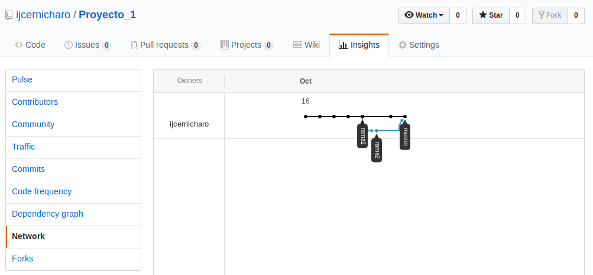

email: ivan.cernicharo@gmail.com
# Proyecto 1
## Paso 1
Creamos el repositorio en Bash y generamos el README.md para el proyecto. Añadimos el README al repositorio con el comando git add README.md y como commit añadimos "Creacion del repositorio y del README".
## Paso 2
Posteriormete creamos un repositorio vacío en mi perfil de GitHub y lo vinculamos al repositorio vacío de GitHub. Las modificaciones adicionales para este README para el paso dos se añaden como git commit -am "Paso 2"
## Paso 3
Generamos el script proyecto1.py y añadimos al commit as "Paso 3, generacion de script python"
## Paso 4
Generacion de rama1 y modificacion del README y del script
## Paso...paso?
Modificacion de master
## Paso perdido, igual es el 6 o 7
Generacion rama 2, merge con rama 1
## Paso final
Hemos resuelto el conflicto y hemos añadido una captura del network del proyecto
